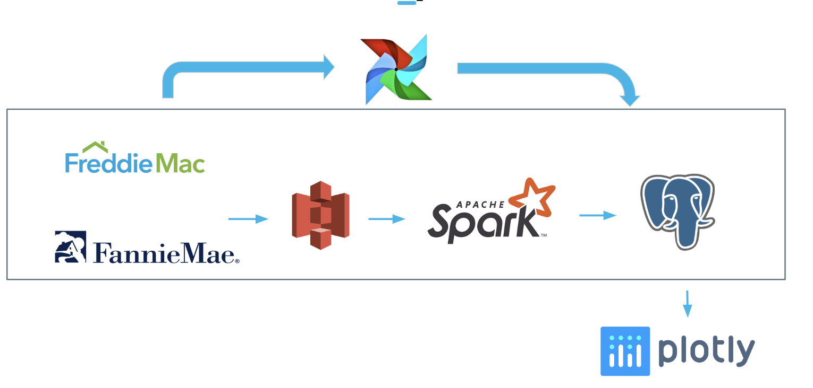

# OneMortgage
>**A tool to integrate and analyze mortgage datasets in different formats from various sources.**

This is a project for the Insight Data Engineering program (New York, Spring 2019).

# Introduction

Mortgage is an important method for people to get financed to buy home. Around 78% of houses in US in 2018 were purchased with mortgage. 
In the mortgage market, single family mortgage loans are a type with large total amount. By 2018 Q3, over 2/3 of all holders' outstanding loans in US are single-famliy mortgage loans. 

Hence, accurately and effectively analyze the single-family mortgage market is important for participants in this market.

In this project, we use big data technologies such as S3, Spark, PostgreSQL(on RDS) on AWS to build a tool to ingest, integrate, clean and analyze single family mortgage datasets released by Freddie Mac and Fannie Mae.

# Approach

This project aims at creating a robust data pipeline for integrating the multiple datasets about single-family mortgage loans.

Raw data are published by Freddie Mac and Fannie Mae, which are a large portion of the single-family mortgage loans they acquired.

# Pipeline

***File System***: historical taxi trip data are ingested from S3 bucket into Spark, which computes top-n pickup locations within every cell of the grid for every 10-minute interval, and saves the result into the PostgreSQL database.

***Batch Processing***: real-time taxi location data are streamed by Kafka into Spark Streaming, where the stream is joined with the results of the batch job to produce the answers for every entry in the stream.

***Data Warehouse***: 

> The whole process is scheduled using Airflow.

### Data Sources

  1. Freddie Mac: [Freddie Mac data](https://freddiemac.embs.com/FLoan/Data/download2.php), for period from 2000 to 2017

  2. Fannie Mae: [Fannie Mae data](https://loanperformancedata.fanniemae.com/lppub/index.html#Portfolio), from 2000 to 2018
 
### Environment Setup

Install and configure [AWS CLI](https://aws.amazon.com/cli/) and [Pegasus](https://github.com/InsightDataScience/pegasus) on your local machine, and clone this repository using
`git clone https://github.com/AndreyBozhko/TaxiOptimizer`.

> AWS security groups setting: Add your local IP to your AWS VPC inbound rules

> Pegasus Tip: In $PEGASUS_HOME/install/download_tech, change Zookeeper version to 3.4.12, and follow the notes in docs/pegasus_setup.odt to configure Pegasus

#### CLUSTER STRUCTURE:

To reproduce my environment, 5 m4.large AWS EC2 instances are needed:

- (4 nodes) Spark Cluster - Batch
- Dash Node

To create the clusters, put the appropriate `master.yml` and `workers.yml` files in each `cluster_setup/<clustername>` folder (following the template in `cluster_setup/dummy.yml.template`), list all the necesary software in `cluster_setup/<clustername>/install.sh`, and run the `cluster_setup/create-clusters.sh` script.

##### Airflow setup

The Apache Airflow scheduler can be installed on the master node of *spark-batch-cluster*. Follow the instructions in `docs/airflow_install.txt` to launch the Airflow server.

##### PostgreSQL setup

The PostgreSQL database sits on AWS RDS instance.

##### Configurations

Configuration settings for PostgreSQL, AWS S3 bucket, as well as the schemas for the data are stored.

##### Schema

## How to start

### Run the Batch Job

### Schedule the Batch Job
Running `airflow/schedule.sh` on the master of *spark-batch-cluster* will add the batch job to the scheduler. The batch job is set to execute every quater, and it can be started and monitored using Airflow UI.

### Frontend:

Run `src/app/run_all.sh` to run the Dash app.

## Author

Sylvia Xu